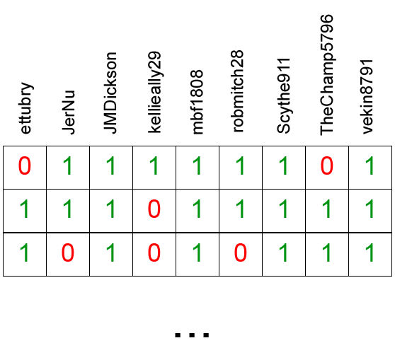

```{r setup, include=FALSE}
knitr::opts_chunk$set(echo = FALSE)
knitr::opts_chunk$set(warning = FALSE, message = FALSE)
library(ggplot2)
library(tidyverse)
library(egg)
library(purrr)
library(jsonlite)
library(kableExtra)
library(gganimate)
```

# Scheduling Luck

There's been some chatter about discrepancies in points for among league leaders at this point in the season. Is it possible that some among our top playoff contenders have benefitted from luck of the draw when it comes to their schedule, playing worse-performing managers on a regular basis?

It's hard to actually quantify how much your opponent's performance every week contributes to your record separately from all of the other factors, but this is what I came up with last year to prove that Kevin was a fraudulent league leader.

We take a manager (we'll use bbopski only because his name is first alphabetically), and we see how they would have done against every other manager in a head-to-head matchup for each week:




and so on, for all 13 weeks. You get the idea. Then we sum all of the wins they would have had against the field, and take the average to derive an *expected number of wins*:


$$
\frac{{\Sigma}VictoriesAgainstEachManager}{NumberOfOtherManagers} = ExpectedWins
$$

By comparing this expected number of wins to their actual number of wins, we can see how much each manager has benefitted from or been hurt by scheduling.

```{r against_the_field}
# read in data
# data are acquired by week as json files, all stored in the working directory; list all files to be read and then bind them into a large matrix
dat_folder <- "data"
to_read <- list.files("data",".json")
all_weeks <- do.call(rbind, Map('cbind',
                  lapply(to_read, function(x) {
                  raw_dat <- read_json(paste(dat_folder, x, sep = '/'))
                                  single_week <- as.data.frame(do.call(rbind, raw_dat)) %>%
                                  select(-custom_points) %>%
                                  pivot_longer(cols = everything()) %>% #because columns are of unequal length (each roster will have only 9 starters, but more players), need to pivot longer and then back to wider to fill in lengths to max number of players on any given roster with NAs
                                  mutate(value = lapply(value, 'length<-', max(lengths(value)))) %>%
                                  pivot_wider(names_from = name, values_from = value) %>%
                                  unnest() %>%
                                  unnest_longer(c(starters_points, starters, roster_id, points, players_points, players, matchup_id))
}), filename = to_read)) %>%
  relocate(filename, .before = 'starters_points') %>%
  mutate(filename = str_sub(filename, 5, 6)) %>%  #grab week number from filename
  rename(week = filename) %>%
  fill(roster_id,
       matchup_id)

# roster ids correspond to managers; I ended up needing to match these manually because I couldn't find that info in the sleeper API
all_weeks <- all_weeks %>%
  mutate(roster_id = case_when(roster_id == 1 ~ 'bbposki',
                               roster_id == 2 ~ 'kellieally',
                               roster_id == 3 ~ 'vekin8791',
                               roster_id == 4 ~ 'mbf1808',
                               roster_id == 5 ~ 'robmitch28',
                               roster_id == 6 ~ 'JerNu',
                               roster_id == 7 ~ 'JMDickson',
                               roster_id == 8 ~ 'ettubry',
                               roster_id == 9 ~ 'Scythe911',
                               TRUE ~ 'TheChamp5796'))

# computing win-loss record
actual_wins <- all_weeks %>%
  rename(manager = roster_id) %>%
  group_by(manager, week, matchup_id) %>%
  summarise(points = sum(points, na.rm = T)) %>%
  arrange(week, matchup_id) %>% 
  group_by(week, matchup_id) %>%
  mutate(win = case_when(points == max(points) ~ 1,
                         TRUE ~ 0)) %>%
  ungroup() %>%
  group_by(manager) %>%
  summarise(wins = sum(win),
            losses = 13 - wins) %>% # change this value based on number of weeks
  pivot_longer(!manager, names_to = 'outcome', values_to = 'count') %>%
  filter(outcome == 'wins')

# computing record against the field
field_points <- all_weeks %>%
  rename(manager = roster_id) %>%
  select(week, manager, points) %>%
  filter(!is.na(points)) %>%
  pivot_wider(names_from = manager, values_from = points) %>%
  select(-week) %>%
  as.matrix() # convert field_points df to matrix so that we can run logical tests

against_the_field_mat <- matrix(0, ncol = 10, nrow = 9*13) #edit the multiplier here to reflect number of weeks

for (i in 1:10) {
# for each manager, perform the following tests - the logical asks if each value in all of the columns of the matrix except for the first column (the target manager) is greater than the values of the target manager's points for that week; converting the logicals to integers replaces any TRUE (manager would have won) with a 1, and FALSE (manager would have lost) with a 0, and outputs a 1-column string of integers we can sum up to derive total wins against the field

indices <- c(1:10)
indices <- indices[-i]
  #c(1, 2, 3, 4, 5, 6, 7, 8, 9, 10) and remove i
field_comp <-  as.integer(field_points[,i] > field_points[,indices]) 

# assign the against the field wins column to the pre-defined matrix for final averaging
against_the_field_mat[,i] <- field_comp
}

# convert matrix to tibble for averaging
against_the_field <- against_the_field_mat %>%
  as.tibble()
colnames(against_the_field) <- colnames(field_points) # assign manager names

against_the_field <- against_the_field %>%
  pivot_longer(everything(), names_to = 'manager', values_to = 'record') %>%
  group_by(manager) %>%
  summarize(expected_wins = (sum(record)/9)) %>%
  mutate(expected_wins = as.numeric(format(expected_wins, digits = 1,  nsmall = 2)))

table_dat <- left_join(against_the_field, actual_wins, by = 'manager') %>%
  select(-outcome) %>%
  rename(actual_wins = count) %>%
  mutate(difference = actual_wins - expected_wins)

table_dat %>%
  mutate(difference = cell_spec(difference, color = case_when(table_dat$difference > 1 ~ "green",
                              table_dat$difference < -1 ~ "red",
                              TRUE ~ "black"))) %>%
  kbl(escape = FALSE) %>%
  kable_minimal()

``` 

I've highlighted teams who have >/< 1 win more than they should. Our lucky ducks are Jerick (who as Bill noted earlier should be ~.500; hard to evaluate Jerick's argument that other manager's players underperform against him with just these numbers, but...just keep that in mind I guess), and Rob. 

We do have some managers who seem to have gotten the shaft with their schedules too - ettubry should have about 1 more win. As much as it pains both us and him to hear it, Scythe911 would be expected to have 2 more wins to his name, and Jared is approaching the same (so I guess he's right - his team is stronger than any of us think?).

Shoutout to mbf1808 who is approaching but didn't quite reach my completely arbitrary cutoff, but seems to have been slightly unlucky.

```{r manager_against_the_field}


```


